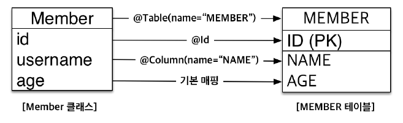
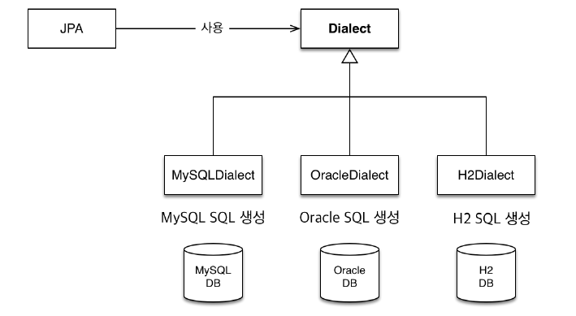
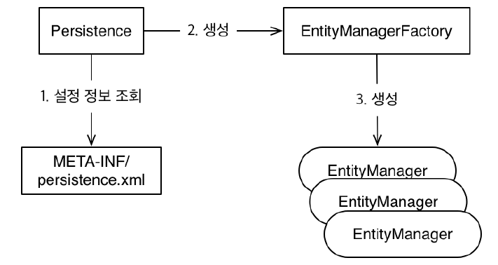

[TOC]

---

### 테이블 생성

```sql
CREATE TABLE MEMBER (
    ID VARCHAR(255) NOT NULL, --아이디(기본 키)
    NAME VARCHAR(255), --이름
    AGE INTEGER, --나이
    PRIMARY KEY (ID)
)
```

<br>

### 테이블과 맞는 회원 클래스 생성

```java
public class Member {
    private String id; //아이디
    private String username; //이름
    private Integer age; //나이

    //Getter, Setter
    public String getId() {
        return id;
    }
    public void setId(String id) {
        this.id = id;
    }

    public String getUsername() {
        return username;
    }
    public void setUsername(String username) {
        this.username = username;
    }

    public Integer getAge() {
        return age;
    }
    public void setAge(Integer age) {
        this.age = age;
    }
}
```

<br>

### 클래스와 테이블 매핑 구조



| 매핑정보        | 자바 클래스 객체 | 테이블 |
| --------------- | ---------------- | ------ |
| 클래스와 테이블 | Member           | MEMBER |
| 기본 키         | id               | ID     |
| 필드와 컬럼     | username         | NAME   |
| 필드와 컬럼     | age              | AGE    |

<br>

### 클래스 객체에 매핑 정보 추가하기

```java
@Entity
@Table(name="MEMBER")
public class Member {

    @Id
    @Column(name = "ID")
    private String id; //아이디
    
    @Column(name = "NAME")
    private String username; //이름
    
    // 매핑정보 필요 X
    private Integer age; //나이

    
    ... 코드 생략 ...
}
```

<br>

`@Entity` , `@Table` , `@Column`이 매핑 정보

> JPA는 매핑 어노테이션을 분석해서 어떤 객체가 어떤 테이블과 관계가 있는지 알아낸다.

`@Entity`

- 이 클래스를 테이블과 매핑한다고 JPA에게 알려준다.
- @Entity 가 사용된 클래스를 엔티티 클래스라 한다.

`@Table`

- 엔티티 클래스에 매핑할 테이블 정보를 알려준다. 
- 여기서는 name 속성을 사용해서 Member 엔티티를 MEMBER 테이블에 매핑했다. 
- 이 어노테이션을 생략하면 클래스 이름을 테이블 이름으로 매핑한다.

`@Id`

- 엔티티 클래스의 필드를 테이블의 기본 키(Primary key)에 매핑한다. 
- 여기서는 엔티티의 id 필드를 테이블의 ID 기본 키 컬럼에 매핑
- 이렇게 @Id 가 사용된 필드를 식별자 필드라 한다.

`@Column`

- 필드를 컬럼에 매핑한다. 
- 여기서는 name 속성을 사용해서 Member 엔티티의 username 필드를 MEMBER 테이블의 NAME 컬럼에 매핑했다.

`매핑정보가 없는 필드`

- age 필드에는 매핑 어노테이션이 없다. 
- 이렇게 매핑 어노테이션을 생략하면 필드명을 사용해서 컬럼명으로 매핑한다. (여기서는 필드명이 age 이므로 age 컬럼으로 매핑) 
- 데이터베이스가 대소문자를 구분하지 않는다고 가정 -> 만약 대소문자를 구분하는 데이터베이스를 사용하면 @Column(name="AGE") 처럼 명시적으로 매핑해야 한다.

<br>

### persistence.xml 설정

> - JPA 기본 설정 파일 - `persistence.xml`
> - JPA는 persistence.xml 을 사용해서 필요한 설정 정보를 관리한다. 
> - 이 설정 파일이 METAINF/persistence.xml 클래스 패스 경로에 있으면 별도의 설정 없이 JPA가 인식할 수 있다.

```xml
<?xml version="1.0" encoding="UTF-8"?>
<persistence xmlns="http://xmlns.jcp.org/xml/ns/persistence" version="2.1">
    <persistence-unit name="jpabook" > 
        <properties>
            <!-- 필수 속성 -->
            <property name="javax.persistence.jdbc.driver" value="org.h2.Driver"/>
            <property name="javax.persistence.jdbc.user" value="sa"/>
            <property name="javax.persistence.jdbc.password" value=""/>
            <property name="javax.persistence.jdbc.url"
                      value="jdbc:h2:tcp://localhost/~/test"/>
            <property name="hibernate.dialect"
                      value="org.hibernate.dialect.H2Dialect" />
            <!-- 옵션 -->
            <property name="hibernate.show_sql" value="true" />
            <property name="hibernate.format_sql" value="true" />
            <property name="hibernate.use_sql_comments" value="true" />
            <property name="hibernate.id.new_generator_mappings" value="true" />
        </properties>
    </persistence-unit>
</persistence>
```

설정 파일 코드 해석

1. `<persistence xmlns="http://xmlns.jcp.org/xml/ns/persistence" version="2.1">` 

   > - 설정 파일은 persistence 로 시작한다. 
   > - 이곳에 XML 네임스페이스와 사용할 버전을 지정한다. 
   > - JPA2.1을 사용하려면 이 xmlns 와 version 을 명시하면 된다.

2. `<persistence-unit name="jpabook" >`

   > - JPA 설정은 영속성 유닛( persistence-unit )이라는 것부터 시작하는데 일반적으로 연결할 데이터베이스당 하나의 영속성 유닛을 등록한다. 
   > - 그리고 영속성 유닛에는 고유한 이름을 부여해야 하는데 jpabook 이라는 이름을 사용

3. 드라이버 속성 - `javax.persistence. ....`

   > ```
   > javax.persistence.jdbc.driver : JDBC 드라이버
   > javax.persistence.jdbc.user : 데이터베이스 접속 아이디
   > javax.persistence.jdbc.password : 데이터베이스 접속 비밀번호
   > javax.persistence.jdbc.url : 데이터베이스 접속 URL
   > ```

4. 하이버네이트 속성 - `<property name="hibernate.dialect" value="org.hibernate.dialect.H2Dialect" />`

   > ```
   > hibernate.show_sql : 하이버네이트가 실행한 SQL을 출력
   > hibernate.format_sql : 하이버네이트가 실행한 SQL을 출력할때 보기 쉽게 정렬
   > hibernate.use_sql_comments : 쿼리를 출력할 때 주석도 함께 출력한다.
   > hibernate.id.new_generator_mappings : JPA 표준에 맞춘 새로운 키 생성 전략
   > 을 사용한다.
   > ```

   > **hibernate.dialect : 데이터베이스 방언(Dialect) 설정**
   >
   > - 이름이 javax.persistence 로 시작하는 속성은 JPA 표준 속성으로 특정 구현체에 종속되지 않는다.
   > - 반면에 hibernate 로 시작하는 속성은 하이버네이트 전용 속성이므로 하이버네이트에서만 사용할 수 있다.
   > - 사용한 속성을 보면 데이터베이스에 연결하기 위한 설정이 대부분이다. 여기서 가장 중요한 속성은 데이터베이스 방언을 설정하는 hibernate.dialect 다.

<br>

### - 데이터베이스 방언( hibernate.dialect )?

JPA는 특정 데이터베이스에 종속적이지 않은 기술이다. 

따라서 다른 데이터베이스로 손쉽게 교체할 수 있는 장점이 있다. 

그런데 각각의 데이터베이스가 제공하는 SQL 문법과 함수가 조금씩 다르다는 문제점이 있다.

> ex) 
>
> 데이터베이스 마다 데이터 타입이 다를 수도 있다. (VARCHAR or VARCHAR2)
>
> 데이터베이스 마다 함수명이 다를 수도 있다. (SUBSTRING() or SUBSTR() )

**이처럼 SQL 표준을 지키지 않거나 특정 데이터베이스만의 고유한 기능을 JPA에서는 방언(Dialect)이라 한다.** 

<br>

애플리케이션 개발자가 특정 데이터베이스에 종속되는 기능을 많이 사용하면 나중에 데이터베이스를 교체하기가 어렵다. 

하이버네이트를 포함한 대부분의 JPA 구현체들은 이런 문제를 해결하려고 다양한 데이터베이스 방언 클래스를 제공한다.
개발자는 JPA가 제공하는 표준 문법에 맞추어 JPA를 사용하면 되고, 특정 데이터베이스에 의존적인 SQL은 데이터베이스 방언이 처리해준다. 

따라서 데이터베이스가 변경되어도 애플리케이션 코드를 변경할 필요 없이 데이터베이스 방언만 변경하면 된다. 



[하이버네이트에서 제공하는 데이터 베이스의 Dialect 설정](http://docs.jboss.org/hibernate/orm/4.3/manual/en-US/html_single/#configuration-optional-dialects)

<br>

**실행 코드**

```java
public class JpaMain {
    public static void main(String[] args) {
        //[엔티티 매니저 팩토리] - 생성
        EntityManagerFactory emf = Persistence.createEntityManagerFactory("jpabook");

        //[엔티티 매니저] - 생성
        EntityManager em = emf.createEntityManager();

        //[트랜잭션] - 획득
        EntityTransaction tx = em.getTransaction();
        try {
            tx.begin(); //[트랜잭션] - 시작
            logic(em); //비즈니스 로직 실행
            tx.commit(); //[트랜잭션] - 커밋
        } catch (Exception e) {
            tx.rollback(); //[트랜잭션] - 롤백
        } finally {
            em.close(); //[엔티티 매니저] - 종료
        }
        emf.close(); //[엔티티 매니저 팩토리] - 종료
    }
    //비즈니스 로직
    private static void logic(EntityManager em) {...}
}
```

### 엔티티 매니저



**[1] 엔티티 매니저 팩토리 생성**
JPA를 시작하려면 우선 persistence.xml 의 설정 정보를 사용해서 엔티티 매니저 팩토리를 생성해야
한다. 

이 때 Persistence 클래스를 사용하는데 이 클래스는 엔티티 매니저 팩토리를 생성해서 JPA를
사용할 수 있게 준비한다.

이렇게 하면 META-INF/persistence.xml 에서 이름이 jpabook 인 영속성 유닛( persistenceunit
)을 찾아서 엔티티 매니저 팩토리를 생성한다. 

이 때 persistence.xml 의 설정 정보를 읽어서 JPA를 동작시키기 위한 기반 객체를 만들고 JPA 구현체에 따라서는 데이터베이스 커넥션 풀도 생성하므로 엔티티 매니저 팩토리를 생성하는 비용은 아주 크다. 

따라서 엔티티 매니저 팩토리는 애플리케이션 전체에서 딱 한 번만 생성하고 공유해서 사용해야 한다.
엔티티 매니저 팩토리를 만들었으니 이제 엔티티 매니저를 생성하자.

**[2] 엔티티 매니저 생성**

- `EntityManager em = emf.createEntityManager();`

엔티티 매니저 팩토리에서 엔티티 매니저를 생성한다. 

JPA의 기능 대부분은 이 엔티티 매니저가 제공한다. 

대표적으로 엔티티 매니저를 사용해서 엔티티를 데이터베이스에 등록/수정/삭제/조회할 수 있다. 

엔티티 매니저는 내부에 데이터소스(데이터베이스 커넥션)를 유지하면서 데이터베이스와 통신한다. 

따라서 애플리케이션 개발자는 엔티티 매니저를 가상의 데이터베이스로 생각할 수 있다.

참고로 엔티티 매니저는 데이터베이스 커넥션과 밀접한 관계가 있으므로 쓰레드간에 공유하거나 재사용하면 안 된다.

사용이 끝난 엔티티 매니저는 **반드시 종료**해야 한다.

자원정리 : `em.close(); //엔티티 매니저 종료`, `emf.close(); //엔티티 매니저 팩토리 종료`

<br>

### 트랜잭션 관리

JPA를 사용하면 항상 트랜잭션 안에서 데이터를 변경해야 한다. 

트랜잭션 없이 데이터를 변경하면 예외가 발생한다. 

트랜잭션을 시작하려면 엔티티 매니저( em )에서 트랜잭션 API를 받아와야 한다.

트랜잭션 API를 사용해서 비즈니스 로직이 정상 동작하면 트랜잭션을 커밋(commit)하고 예외가 발생
하면 트랜잭션을 롤백(rollback)한다.

```java
EntityTransaction tx = em.getTransaction(); //트랜잭션 API
try {
    tx.begin(); //트랜잭션 시작
    logic(em); //비즈니스 로직 실행
    tx.commit(); //트랜잭션 커밋
} catch (Exception e) {
    tx.rollback(); //예외 발생시 트랜잭션 롤백
}
```

<br>

### 비즈니스 로직 

```java
public static void logic(EntityManager em) {
    String id = "id1";
    Member member = new Member();
    member.setId(id);
    member.setUsername("Jaylnne");
    member.setAge(2);
    
    //등록
    em.persist(member);
     
    //수정
    member.setAge(20);
    
    //한 건 조회
    Member findMember = em.find(Member.class, id);
    System.out.println("findMember=" + findMember.getUsername() +
                       ", age=" + findMember.getAge());
    
    //목록 조회
    List<Member> members =
        em.createQuery("select m from Member m", Member.class)
        .getResultList();
    System.out.println("members.size=" + members.size());
    
    //삭제
    em.remove(member);
}
```

> 출력
>
>  ```
> findMember=Jaylnne, age=20
> members.size=1
>  ```

- **등록**

  엔티티를 저장하려면 엔티티 매니저의 persist() 메서드에 저장할 엔티티를 넘겨주면 된다. 

  회원 엔티티를 생성하고 em.persist(member) 를 실행해서 엔티티를 저장했다. 

  JPA는 회원 엔티티의 매핑 정보(어노테이션)를 분석해서 다음과 같은 SQL을 만들어 데이터베이스에 전달한다.

  **[ 비교 ]**

  ```java
  String id = "id1";
  Member member = new Member();
  member.setId(id);
  member.setUsername("Jaylnne");
  member.setAge(2);
  ```

  ```sql
  INSERT INTO MEMBER (ID, NAME, AGE) VALUES ('id1', 'Jaylnne', 2)
  ```

<br>

- **수정**

  단순히 엔티티의 값만 변경했다. 

  JPA는 어떤 엔티티가 변경되었는지 추적하는 기능을 갖추고 있다. 

  따라서 member.setAge(20) 처럼 엔티티의 값만 변경하면 다음과 같은 UPDATE SQL을 생성해서 데이터베이스에 값을 변경한다. 

  **[ 비교 ]**

  ```java
  member.setAge(20);
  ```

  ```sql
  UPDATE MEMBER
  SET AGE=20, NAME='Jaylnne'
  WHERE ID='id1'
  ```

<br>

- **삭제**

  엔티티를 삭제하려면 엔티티 매니저의 remove() 메서드에 삭제하려는 엔티티를 넘겨준다. JPA는
  DELETE SQL을 생성해서 실행한다.

  **[ 비교 ]**

  ```java
  em.remove(member);
  ```

  ```sql
  DELETE FROM MEMBER WHERE ID = 'id1'
  ```

<br>

- **한 건 조회**

  `find()` 메소드는 조회할 엔티티 타입과 `@Id`로 데이터베이스 테이블의 기본 키와 매핑한 식별자 값으로 엔티티 하나를 조회하는 가장 단순한 조회 메서드다. 

  이 메서드를 호출하면 SELECT SQL을 생성해서 데이터베이스에 결과를 조회한다. 그리고 조회한 결과 값으로 엔티티를 생성해서 반환한다.

  **[ 비교 ]**

  ```java
  Member findMember = em.find(Member.class, id);
  ```

  ```sql
  SELECT * FROM MEMBER WHERE ID='id1'
  ```

<br>

- **목록 조회** 

  JPA를 사용하면 애플리케이션 개발자는 엔티티 객체를 중심으로 개발하고 데이터베이스에 대한 처리는  JPA에 맡겨야 한다. 

  여기서 문제는 검색 쿼리다. JPA는 엔티티 객체를 중심으로 개발하므로 검색을 할 때도 테이블이 아닌 엔티티 객체를 대상으로 검색해야 한다.

  그런데 테이블이 아닌 엔티티 객체를 대상으로 검색하려면 데이터베이스의 모든 데이터를 애플리케이션으로 불러와서 엔티티 객체로 변경한 다음 검색해야 하는데, 이는 사실상 불가능하다.

  애플리케이션이 필요한 데이터만 데이터베이스에서 불러오려면 결국 검색 조건이 포함된 SQL을 사용해야 한다. 

  ```java
  //목록 조회
  TypedQuery<Member> query =
      em.createQuery("select m from Member m", Member.class);
  List<Member> members = query.getResultList();
  ```

  **JPA는 JPQL이라는 쿼리 언어로 이런 문제를 해결한다.**

<br>

### - JPQL(Java Persistence Query Language)

JPA는 SQL을 추상화한 JPQL이라는 객체 지향 쿼리 언어를 제공한다. 

JPQL은 SQL과 문법이 거의 유사해서 SELECT, FROM, WHERE, GROUP BY, HAVING, JOIN 등을 사용할 수 있다. 

**[ 둘의 가장 큰 차이점 ]**

- JPQL은 엔티티 객체를 대상으로 쿼리한다. 쉽게 이야기해서 클래스와 필드를 대상으로 쿼리한다.
- SQL은 데이터베이스 테이블을 대상으로 쿼리한다.

예제에서 `select m from Member m` 이 바로 **JPQL** 이다. 

여기서 `from Member` 는 회원 엔티티 객체를 말하는 것이지 MEMBER 테이블이 아니다. 

JPQL은 데이터베이스 테이블에 대해 전혀 알지 못한다. JPQL을 사용하려면 먼저 `em.createQuery(JPQL, 반환 타입)` 메소드를 실행해서 쿼리 객체를 생성한 후 쿼리 객체의 `getResultList()` 메소드를 호출하면 된다. 

JPA는 JPQL을 분석해서 적절한 SQL을 만들어 데이터베이스에서 데이터를 조회한다.

---

**JPA가 실행한 SQL**
`SELECT M.ID, M.NAME, M.AGE FROM MEMBER M`

---

> JPQL은 대소문자를 명확하게 구분하지만, SQL은 관례상 대소문자를 구분하지 않고 사용하는 경우가 많다. 책에서는 JPQL과 SQL을 구분하려고 SQL은 될 수 있으면 대문자로 표현


